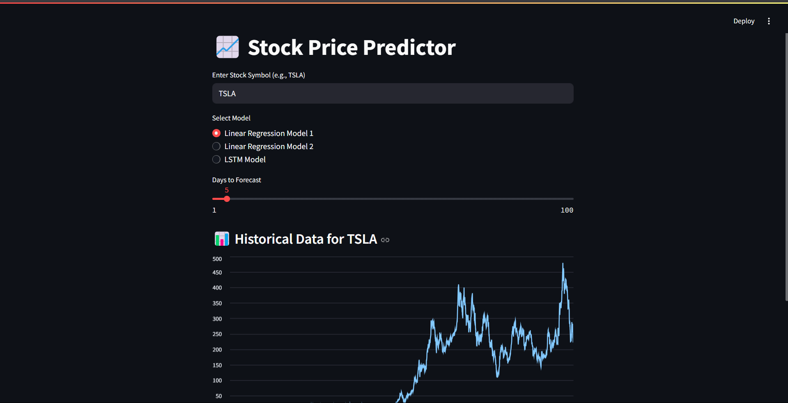
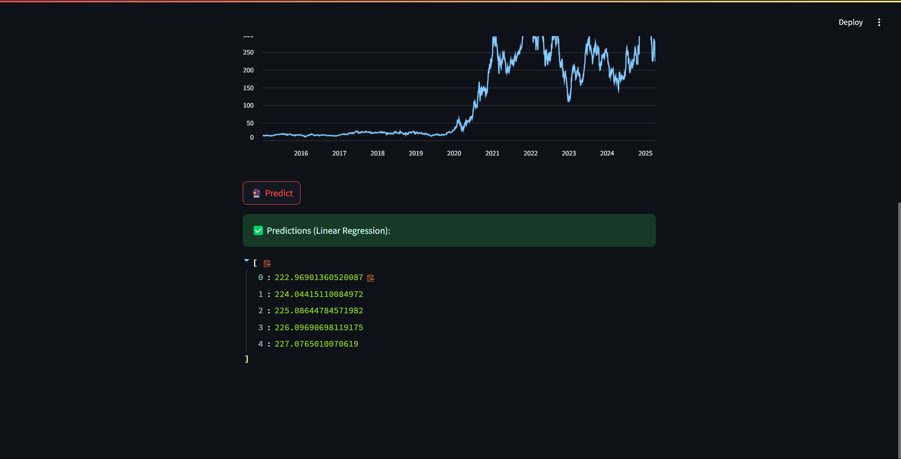

# 📈 Stock Price Prediction App

A Machine Learning web application built with **Streamlit** that predicts future stock prices using three different models:
- **Linear Regression (Basic)**
- **Linear Regression (Enhanced)**
- **LSTM (Long Short-Term Memory)**

---

## 🚀 Features

- Visualizes historical stock data (from 2015–2025)
- Predicts next 7–10 days of stock prices
- Option to select between different prediction models
- Easy-to-use Streamlit interface
- Supports multiple stock tickers (e.g., TSLA, AAPL, GOOGL)

---

## 📂 Folder Structure

📁 stock-predictor-app/ │
├── 📄 app.py # Streamlit UI
├── 📄 lstm_model.h5 # Trained LSTM model 
├── 📄 linear_model.pkl  # First linear regression model 
├── 📄 linear_model_1.pkl # Second linear regression model (enhanced) 
├── 📄 requirements.txt # Dependencies
├── 📄 Stock Predictions Model.keras # LSTM model architecture
├── 📄 README.md # You're here! 

---

## 🔧 How to Run

1. Clone the repository:
```bash
git clone https://github.com/namansharma28/StockPredictorModel.git
cd stock-predictor-app

#Install dependencies:
pip install -r requirements.txt

#Run the app:
streamlit run app.py
```

🧠 Models Overview
Linear Regression (Basic): Predicts based on previous close prices.

Linear Regression (v2): Uses moving averages (MA10, MA50) as additional features.

LSTM: Deep learning model trained on 100-day windows of closing prices.


📈 Example Output



## Made with ❤️ by Naman

---

If you want, I can generate this file for you and even help fill in some project-specific sections automatically. Want me to drop a full version here with a bit of your styling or name on it?
